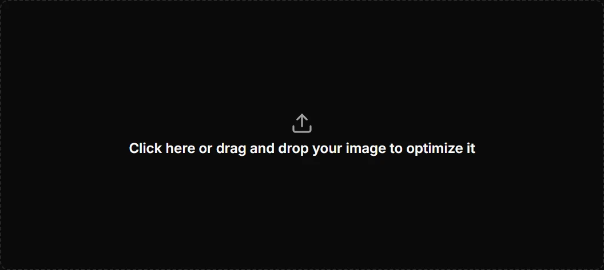
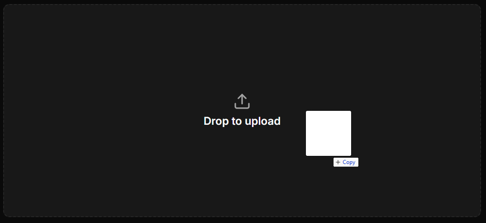
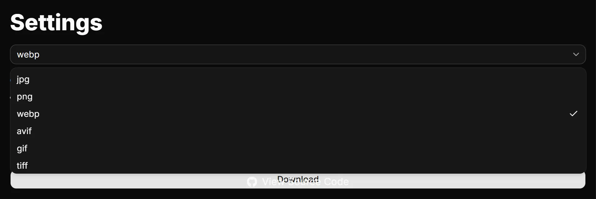
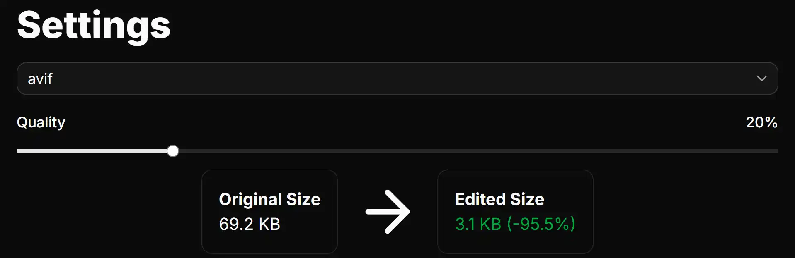
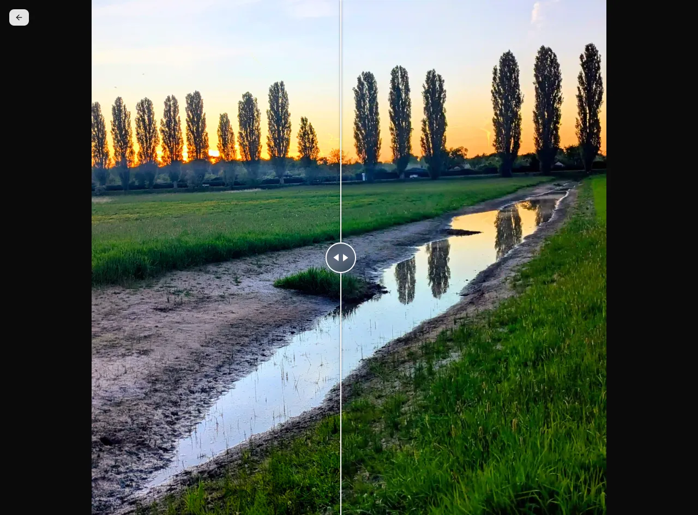
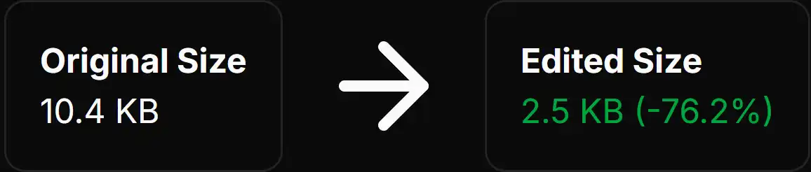

# Image Optimizer

A Fullstack Web app built with Next.js for compressing and optimizing images. <br>
**<a href="https://image-optimizer-online.vercel.app/">Live Demo</a>**

<p align="center">
    
    

</p>

# Tech Stack

<p align="center">
    
    
    
    
    
</p>

**Framework:** Next.js 16.2 (App Router) <br>
**Frontend:** React, TailwindCSS, Shadcn/ui <br>
**Image Processing:** Sharp library <br>

# Features

## Drag-and-Drop Interface

Easily upload images either by dragging and dropping or by selecting an image from your device.

<p align="center">
    
    
</p>

## Format Conversion

Convert your image to modern, optimized formats like _WebP_ (recommended), _AVIF_ _JPG_ or _PNG_.

<p align="center">
    
</p>

### Supported Formats

#### Input Formats

- JPG/JPEG
- PNG
- WebP
- GIF
- AVIF
- TIFF
- SVG

#### Output Formats

- JPG/JPEG
- PNG
- WebP
- GIF
- AVIF
- TIFF

## Quality Controls

Adjust the image's quality to decrease the file size by up to 90% (best results with WebP and AVIF).

<p align="center">
    
</p>

## Live Before/After Comparison

An interactive diff image preview to check the image's quality after compression.

<p align="center">
    
</p>

## Real-time File Size Comparison

Check the optimized size easily without needing to download.

<p align="center">
    
</p>

# Why I Built This

I wanted to build an image optimization tool with a clean UI and high compression efficiency while learning more about file handling and image processing in modern web applications.

# Getting Started

## Clone the Repository

```bash
git clone https://github.com/raptorassassin/image-optimizer.git
cd image-optimizer
```

## Install Dependencies

```bash
npm install
```

## Run Development Server

```bash
npm run dev
```

---

Open <a href="http://localhost:3000">http://localhost:3000</a> in your browser.

# Credits

- Sharp
- Shadcn
- React Diff Viewer
