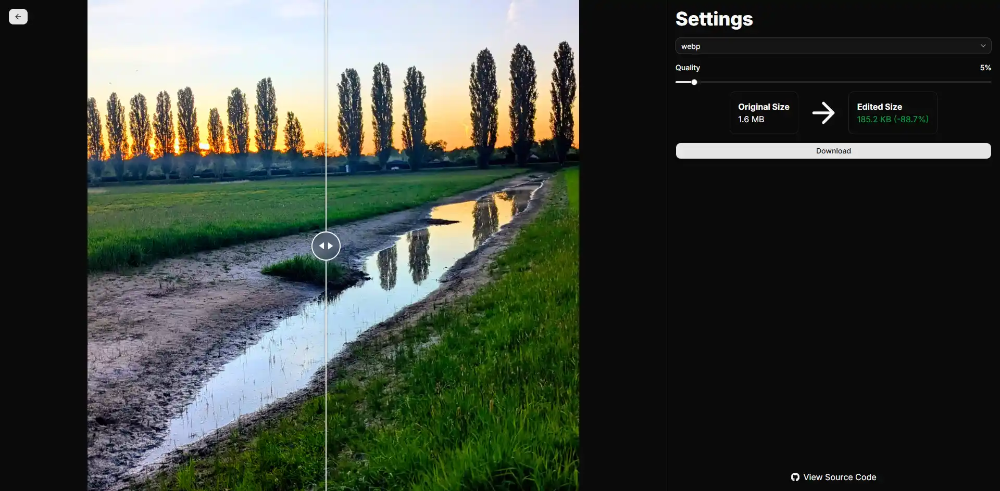

# Image Optimizer

A Fullstack Web app built with Next.js for compressing and optimizing images with drag-and-drop uploading, a before-after diff viewer and file size comparison.

# Description

Image Optimizer is a web tool that offers different options to compress, resize, and optimize your images.

# Tech Stack

    

This tool is built using *Next.js* (App Router) and *React*.
